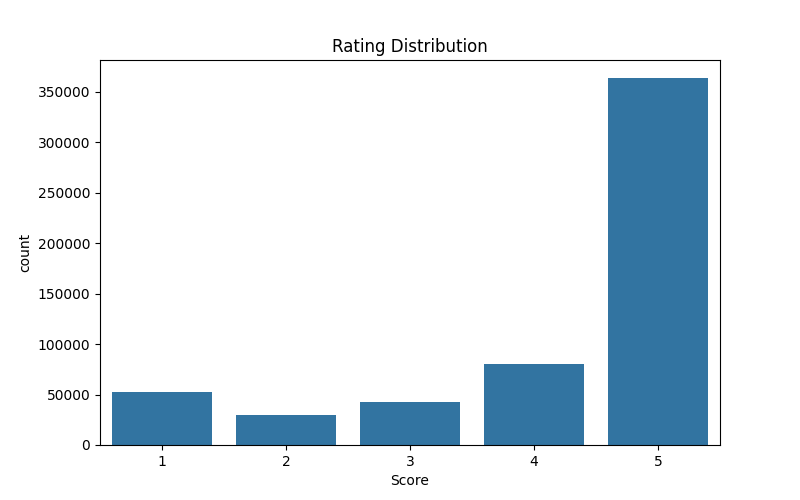
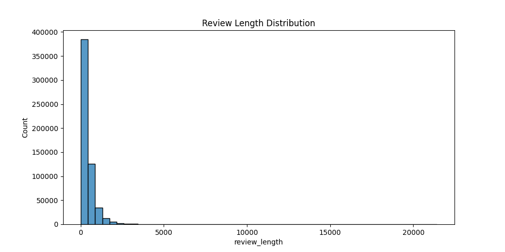
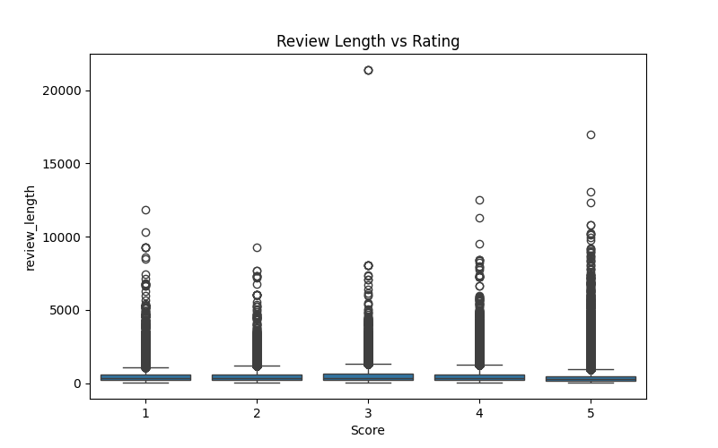
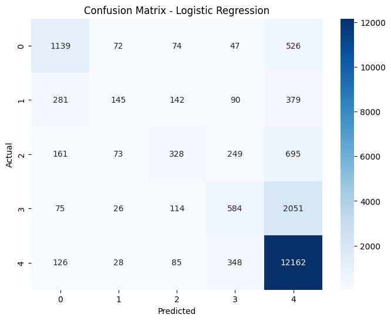

# Amazon Product Intelligence Engine

An end-to-end Machine Learning application that predicts Amazon product ratings from review text and recommends similar products using Natural Language Processing (NLP).

Built using **Scikit-Learn, FastAPI, React, and TF-IDF Vectorization** on over **568,000 Amazon product reviews**.

---

## Features

### Rating Prediction

Predicts a product rating (1–5 stars) from user review text using a trained Machine Learning model.

### Product Recommendation

Recommends similar products by analyzing review content and computing cosine similarity between product review profiles.

### Interactive Web Application

* React Frontend
* FastAPI Backend
* Real-time predictions
* Real-time recommendations

---

## Dataset

The dataset used for this project is the Amazon Product Reviews dataset from Kaggle.

Due to GitHub file size limitations, the processed dataset is not included in this repository.

To recreate the dataset:

1. Install dependencies from `requirements.txt`
2. Run `preprocess.py`
3. The cleaned dataset will be generated automatically inside `backend/processed_data/`

### Dataset Statistics

| Metric         | Value     |
| -------------- | --------- |
| Reviews        | 568,454   |
| Products       | 74,258    |
| Users          | 256,059   |
| Rating Classes | 1–5 Stars |

---

## Machine Learning Pipeline

### Data Preprocessing

* Removed missing values
* Removed duplicate reviews
* Removed very short reviews
* Text cleaning and normalization
* Review length feature generation

### Feature Engineering

* TF-IDF Vectorization
* Maximum Features: 10,000
* Summary + Review Text Combination

### Model Training

Models evaluated:

| Model                                |   Accuracy |
| ------------------------------------ | ---------: |
| Logistic Regression (Text)           |     73.91% |
| Logistic Regression (Summary + Text) | **75.62%** |
| Linear SVM                           |     71.43% |
| Multinomial Naive Bayes              |     66.25% |

### Best Model

**Logistic Regression using Summary + Review Text**

Accuracy:

```text
75.62%
```

---

## Recommendation System

A content-based recommendation engine was developed using:

* TF-IDF Vectorization
* Cosine Similarity
* Product Review Aggregation

The system recommends products with similar review content.

Example:

```text
Input Product:
141278509X

Top Similar Products:
B001EQ4HEE
B0058M8PFC
B004XG2H94
B004BKHX0U
B001SB1G8U
```

---

## Tech Stack

### Machine Learning

* Scikit-Learn
* Pandas
* NumPy

### Backend

* FastAPI
* Uvicorn
* Pydantic

### Frontend

* React
* Vite

### Visualization

* Matplotlib
* Seaborn

---

## Project Structure

```text
amazon-product-intelligence/

├── backend/
│   ├── main.py
│   ├── preprocess.py
│   ├── train_models.py
│   ├── recommendation.py
│   ├── schemas.py
│   ├── models/
│   ├── processed_data/
│   └── requirements.txt
│
├── frontend/
│
├── assets/
│
├── README.md
└── .gitignore
```
---

## Screenshots

### Dashboard

Add screenshot here

### Rating Prediction

Add screenshot here

### Product Recommendation

Add screenshot here

### EDA Visualizations

Add screenshots here

---

## Installation

### Backend

```bash
cd backend

pip install -r requirements.txt

uvicorn main:app --reload
```

### Frontend

```bash
cd frontend

npm install

npm run dev
```

---

## API Endpoints

### Health Check

```http
GET /health
```

### Rating Prediction

```http
POST /predict_rating
```

Request:

```json
{
  "review": "This product is amazing."
}
```

### Product Recommendation

```http
POST /recommend
```

Request:

```json
{
  "product_id": "141278509X"
}
```
## Exploratory Data Analysis

### Rating Distribution



### Review Length Distribution



### Review Length vs Rating



## Model Evaluation

### Confusion Matrix


---

## Future Improvements

* Transformer-based sentiment models (BERT)
* Product metadata integration
* Recommendation explanations
* Cloud deployment
* User authentication
* Recommendation feedback system

---

## Author

Oorjaa Sonthalia

Machine Learning • NLP • Full Stack AI Applications
